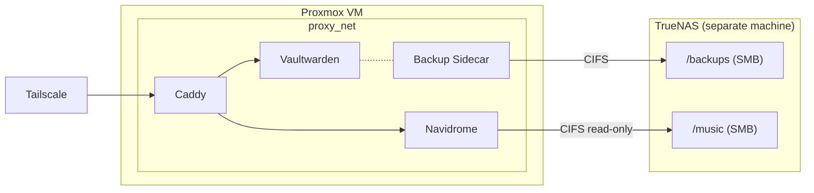

# 🏠 Homelab

Docker Compose homelab running behind Caddy (reverse proxy) and Tailscale (VPN). Backups and media are stored on TrueNAS via SMB/CIFS.

## 🏗️ Architecture



- 🌐 **Gateway** — Caddy with Cloudflare DNS-01 TLS, exposed via Tailscale sidecar
- 🔐 **Security** — Vaultwarden with daily backup to TrueNAS
- 🎵 **Media** — Navidrome streaming from TrueNAS music share

## 📋 Prerequisites

- A Proxmox VM running Linux (Debian/Ubuntu recommended)
- A TrueNAS server with SMB shares configured
- A Cloudflare account managing your domain's DNS
- A Tailscale account

## 🚀 Setup

### 1. Clone the repo

```bash
git clone <repo-url> ~/homelab
cd ~/homelab
```

### 2. Install Docker and Tailscale

```bash
./install.sh
```

⚠️ Log out and back in for the docker group to take effect.

### 3. Authenticate Tailscale on the host

```bash
tailscale up
```

### 4. Initialize the homelab

```bash
./init.sh
```

This creates the `proxy_net` Docker network and copies `.env.template` into each stack directory.

### 5. Configure environment variables

Edit each stack's `.env` file with your credentials:

**gateway/.env**

| Variable | Description |
|---|---|
| `DOMAIN` | Your base domain (e.g. `life.marcsolanadal.com`) |
| `CLOUDFLARE_API_TOKEN` | API token with DNS edit permissions for your zone |
| `TS_AUTHKEY` | Tailscale auth key (generate at Tailscale admin console > Settings > Keys) |

**security/.env**

| Variable | Description |
|---|---|
| `TZ` | Timezone (e.g. `Europe/Madrid`) |
| `VAULTWARDEN_ADMIN_TOKEN` | Admin panel token — generate with `openssl rand -base64 48` |
| `NAS_IP` | TrueNAS IP address |
| `NAS_BACKUP_SHARE` | SMB share name for backups |
| `NAS_BACKUP_USER` | NAS user for backup share |
| `NAS_BACKUP_PASSWORD` | NAS password for backup share |

**media/.env**

| Variable | Description |
|---|---|
| `TZ` | Timezone (e.g. `Europe/Madrid`) |
| `NAS_IP` | TrueNAS IP address |
| `NAS_MUSIC_SHARE` | SMB share name for music library |
| `NAS_MUSIC_USER` | NAS user for music share |
| `NAS_MUSIC_PASSWORD` | NAS password for music share |

### 6. DNS

A wildcard A record (`*.<DOMAIN>`) points directly to the server IP in Cloudflare. This avoids double-hopping through the Cloudflare proxy, which causes issues with Android clients. No per-service DNS changes needed — all subdomains resolve automatically.

### 7. Start the stacks

```bash
./start.sh
```

This starts gateway, security, and media in order.

### 8. ✅ Verify

```bash
# Check Caddy TLS certificates
docker compose -f gateway/docker-compose.yml logs caddy

# Check Tailscale connectivity
docker exec tailscale-gateway tailscale status

# Check all containers are running
docker ps
```

## 💾 TrueNAS Setup

Before starting the security and media stacks, make sure your TrueNAS server has:

1. **Two SMB shares** — one for Vaultwarden backups, one for the music library
2. **Dedicated users** — a backup user (read/write) and a music user (read-only)
3. **CIFS utils installed** on the VM: `sudo apt install cifs-utils`

## ➕ Adding a New Service

To expose a service running on a different Proxmox VM (e.g. `192.168.1.50:8080`), add a block to `gateway/Caddyfile`:

```
myapp.{$DOMAIN} {
    reverse_proxy 192.168.1.50:8080
    import cloudflare
}
```

Then reload Caddy:

```bash
docker exec caddy caddy reload --config /etc/caddy/Caddyfile
```

## 🔄 Backups

Vaultwarden is backed up daily at 03:00 AM to the TrueNAS SMB share. The backup sidecar:

- Pauses the Vaultwarden container during backup to prevent SQLite corruption
- Retains 30 days of backups with automatic rotation
- Stores backups as `vaultwarden-<timestamp>.tar.gz`

## 📁 File Structure

```
~/homelab/
├── install.sh              # Installs Docker and Tailscale
├── init.sh                 # Creates network, dirs, and .env files
├── start.sh                # Starts all stacks in order
├── .env.template           # Master env template
├── gateway/
│   ├── docker-compose.yml  # Tailscale + Caddy
│   ├── Dockerfile          # Caddy with Cloudflare DNS plugin
│   ├── Caddyfile           # Reverse proxy config
│   └── .env
├── security/
│   ├── docker-compose.yml  # Vaultwarden + backup sidecar
│   └── .env
└── media/
    ├── docker-compose.yml  # Navidrome
    └── .env
```
