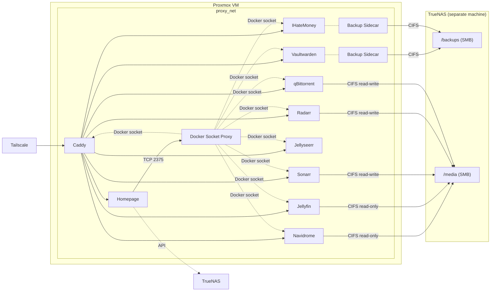
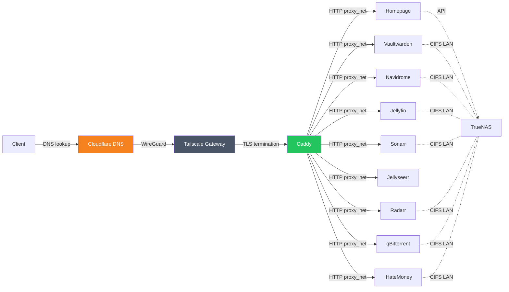

# 🏠 Homelab

Docker Compose homelab running behind Caddy (reverse proxy) and Tailscale (VPN). Backups and media are stored on TrueNAS via SMB/CIFS.

## 🏗️ Architecture



- 🌐 **Gateway** — Caddy with Cloudflare DNS-01 TLS, exposed via Tailscale sidecar
- 🔐 **Security** — Vaultwarden with daily backup to TrueNAS
- 🎵 **Music** — Navidrome streaming from TrueNAS music share
- 🎬 **Video** — Jellyfin (streaming), Jellyseerr (requests), Sonarr (TV), Radarr (movies)
- ⬇️ **Downloads** — qBittorrent download client
- 💰 **Finance** — IHateMoney shared expense tracker with daily backup to TrueNAS
- 📊 **Dashboard** — Homepage at `home.<DOMAIN>` with service status, Docker stats (via socket proxy), and server health

## 📂 NAS Share Structure

All media services mount subfolders of a single SMB share on TrueNAS:

```
media/           ← single SMB share
├── downloads/   ← qBittorrent download directory
├── movies/      ← Radarr library
├── tv/          ← Sonarr library
└── music/       ← Navidrome library
```

Sonarr/Radarr and qBittorrent mount the full share so hardlinks work for atomic moves between `downloads/` and the library folders.

## 🌐 Network Flow



- **External**: encrypted via Tailscale (WireGuard) + Caddy (Let's Encrypt TLS)
- **Internal**: plain HTTP over Docker's `proxy_net` — never leaves the host
- **NAS**: direct LAN connection via CIFS, no Tailscale routing

## 📋 Prerequisites

- A Proxmox server
- A TrueNAS server with SMB shares configured
- A Cloudflare account managing your domain's DNS
- A Tailscale account

## 🖥️ VM Creation (from Proxmox host)

Run this from any machine with the repo cloned, via SSH to the Proxmox host:

```bash
ssh root@<proxmox-ip> "SSH_PUB_KEY='$(cat ~/.ssh/id_infra_v2.pub)' bash -s" < create-vm.sh
```

Or with custom variables:

```bash
ssh root@<proxmox-ip> "SSH_PUB_KEY='$(cat ~/.ssh/id_infra_v2.pub)' VMID=300 CORES=8 bash -s" < create-vm.sh
```

This downloads an Ubuntu 24.04 cloud image, creates the VM, and uses cloud-init to automatically install Docker, Tailscale, git, and cifs-utils, then clones the repo and runs `init.sh`.

Override defaults with environment variables:

| Variable | Default | Description |
|---|---|---|
| `VMID` | `200` | Proxmox VM ID |
| `VM_NAME` | `homelab` | VM name |
| `CORES` | `4` | CPU cores |
| `MEMORY` | `4096` | RAM in MB |
| `DISK_SIZE` | `32G` | Disk size |
| `STORAGE` | `local-lvm` | Proxmox storage pool |
| `BRIDGE` | `vmbr0` | Network bridge |
| `VLAN_TAG` | `20` | VLAN tag for the VM network |
| `VM_USER` | `ubuntu` | VM login username |
| `SSH_PUB_KEY` | *(required)* | SSH public key content (e.g. `$(cat ~/.ssh/id_infra_v2.pub)`) |

```bash
# Example: custom VM ID with more resources
ssh root@<proxmox-ip> "SSH_PUB_KEY='$(cat ~/.ssh/id_infra_v2.pub)' VMID=300 CORES=8 MEMORY=8192 bash -s" < create-vm.sh
```

## 🚀 Setup (inside the VM)

After the VM boots, SSH in and complete the remaining manual steps:

### 1. Authenticate Tailscale

```bash
tailscale up
```

### 2. Configure environment variables

Edit each stack's `.env` file in `/opt/homelab/` with your credentials:

**gateway/.env**

| Variable | Description |
|---|---|
| `DOMAIN` | Your base domain (e.g. `life.marcsolanadal.com`) |
| `CLOUDFLARE_API_TOKEN` | API token — create at My Profile > API Tokens > **Edit zone DNS** template, scoped to your domain's zone |

> **Warning**: The Cloudflare API token must have both **Zone:DNS:Edit** and **Zone:Zone:Read** permissions, scoped to your domain's zone. Without these, Caddy's DNS-01 challenge will fail with "timed out waiting for record to fully propagate".

> **Note**: If certificate issuance fails repeatedly, check for stale `_acme-challenge` TXT records in Cloudflare DNS. Duplicate records from previous failed attempts can block propagation. Delete them manually in the Cloudflare dashboard (or via API), then restart Caddy with a clean volume: `docker volume rm gateway_caddy_data`.
| `TAILSCALE_AUTHKEY` | Tailscale auth key (generate at Tailscale admin console > Settings > Keys) |

**security/.env**

| Variable | Description |
|---|---|
| `TIMEZONE` | Timezone (e.g. `Europe/Madrid`) |
| `VAULTWARDEN_ADMIN_TOKEN` | Admin panel token — generate with `openssl rand -base64 48` |
| `NAS_IP` | TrueNAS IP address |
| `NAS_BACKUP_SHARE` | SMB share name for backups |
| `NAS_BACKUP_USER` | NAS user for backup share |
| `NAS_BACKUP_PASSWORD` | NAS password for backup share |

**music/.env**

| Variable | Description |
|---|---|
| `TIMEZONE` | Timezone (e.g. `Europe/Madrid`) |
| `NAS_IP` | TrueNAS IP address |
| `NAS_MEDIA_SHARE` | SMB share name for the media share (e.g. `media`) |
| `NAS_MEDIA_USER` | NAS user for media share |
| `NAS_MEDIA_PASSWORD` | NAS password for media share |

**video/.env**

| Variable | Description |
|---|---|
| `TIMEZONE` | Timezone (e.g. `Europe/Madrid`) |
| `PUID` | User ID for linuxserver containers (e.g. `1000`) |
| `PGID` | Group ID for linuxserver containers (e.g. `1000`) |
| `NAS_IP` | TrueNAS IP address |
| `NAS_MEDIA_SHARE` | SMB share name for the media share (e.g. `media`) |
| `NAS_MEDIA_USER` | NAS user for media share |
| `NAS_MEDIA_PASSWORD` | NAS password for media share |

**downloads/.env**

| Variable | Description |
|---|---|
| `TIMEZONE` | Timezone (e.g. `Europe/Madrid`) |
| `PUID` | User ID for linuxserver containers (e.g. `1000`) |
| `PGID` | Group ID for linuxserver containers (e.g. `1000`) |
| `NAS_IP` | TrueNAS IP address |
| `NAS_MEDIA_SHARE` | SMB share name for the media share (e.g. `media`) |
| `NAS_MEDIA_USER` | NAS user for media share |
| `NAS_MEDIA_PASSWORD` | NAS password for media share |

**finance/.env**

| Variable | Description |
|---|---|
| `TIMEZONE` | Timezone (e.g. `Europe/Madrid`) |
| `IHATEMONEY_SECRET_KEY` | Secret key for session signing — generate with `openssl rand -base64 48` |
| `NAS_IP` | TrueNAS IP address |
| `NAS_BACKUP_SHARE` | SMB share name for backups |
| `NAS_BACKUP_USER` | NAS user for backup share |
| `NAS_BACKUP_PASSWORD` | NAS password for backup share |

**dashboard/.env**

| Variable | Description |
|---|---|
| `DOMAIN` | Your base domain (e.g. `life.marcsolanadal.com`) |
| `NAVIDROME_USER` | Navidrome username (for the Subsonic API widget) |
| `NAVIDROME_TOKEN` | `md5(password + salt)` — see [Subsonic API docs](http://www.subsonic.org/pages/api.jsp) |
| `NAVIDROME_SALT` | Random salt string (e.g. `openssl rand -hex 8`) |
| `TRUENAS_IP` | TrueNAS IP or hostname (e.g. `nas.home.lab`) |
| `TRUENAS_KEY` | TrueNAS API key — generate at TrueNAS UI → user icon → **API Keys** → **Add** |

> **Note**: The Navidrome widget uses the Subsonic API token auth scheme. The token is **not** your password — it's `md5(password + salt)`. Generate it with: `echo -n "yourpassword$(openssl rand -hex 8)" | md5sum`

> **Note**: Homepage requires `HOMEPAGE_ALLOWED_HOSTS` to match the hostname in the request. This is set automatically from `DOMAIN` in the compose file. If you see 403 errors, check this value matches your subdomain.

> **Note**: The Caddy admin API is enabled via `CADDY_ADMIN=:2019` in the gateway compose file. This binds to all interfaces inside the container (needed because Caddy uses `network_mode: service:tailscale`). It's only reachable from other containers on `proxy_net` as `tailscale-gateway:2019` — not exposed to the internet. The Homepage Caddy widget uses this to show upstream/request stats.

> **Note**: Homepage reads Docker container stats (CPU, memory, network) via a [Docker socket proxy](https://github.com/Tecnativa/docker-socket-proxy) instead of mounting the socket directly. The proxy only allows read access to containers, images, and networks — all write and dangerous endpoints (exec, commit, etc.) are denied by default. The host filesystem is mounted at `/host` (read-only) for disk usage metrics.

> **Note**: The TrueNAS widget connects to the TrueNAS REST API over the LAN (not via Tailscale). It shows load, uptime, alerts, and pool usage. The API key is scoped per-user — generate it from the TrueNAS web UI under your user's API Keys page.

### 3. DNS

A wildcard A record (`*.<DOMAIN>`) points directly to the server IP in Cloudflare. This avoids double-hopping through the Cloudflare proxy, which causes issues with Android clients. No per-service DNS changes needed — all subdomains resolve automatically.

### 4. Start the stacks

```bash
./start.sh
```

This starts gateway, security, music, downloads, video, finance, and dashboard in order.

### 5. ✅ Verify

```bash
# Check Caddy TLS certificates
docker compose -f gateway/docker-compose.yml logs caddy

# Check Tailscale connectivity
docker exec tailscale-gateway tailscale status

# Check all containers are running
docker ps
```

## 💾 TrueNAS Setup

Before starting the stacks, make sure your TrueNAS server has:

1. **SMB shares** — a backup share for Vaultwarden/IHateMoney, and a media share with subdirectories for music, movies, tv, and downloads
2. **Dedicated users** — a backup user (read/write) and a media user (read/write for Sonarr/Radarr/qBittorrent, read-only for Navidrome/Jellyfin)
3. **CIFS utils installed** on the VM: `sudo apt install cifs-utils`

## ➕ Adding a New Service

To expose a service running on a different Proxmox VM (e.g. `192.168.1.50:8080`), add a block to `gateway/Caddyfile`:

```
myapp.{$DOMAIN} {
    reverse_proxy 192.168.1.50:8080
    import cloudflare
}
```

Then reload Caddy:

```bash
docker exec caddy caddy reload --config /etc/caddy/Caddyfile
```

## 🔄 Backups

Vaultwarden and IHateMoney are backed up daily at 03:00 AM to the TrueNAS SMB share. Each backup sidecar:

- Pauses the application container during backup to prevent SQLite corruption
- Retains 30 days of backups with automatic rotation
- Stores backups as `<service>-<timestamp>.tar.gz`
