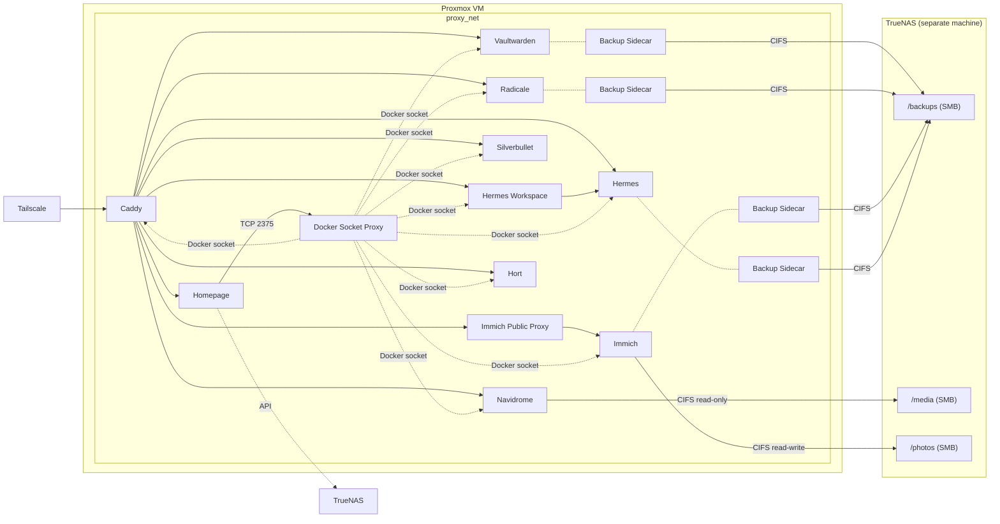
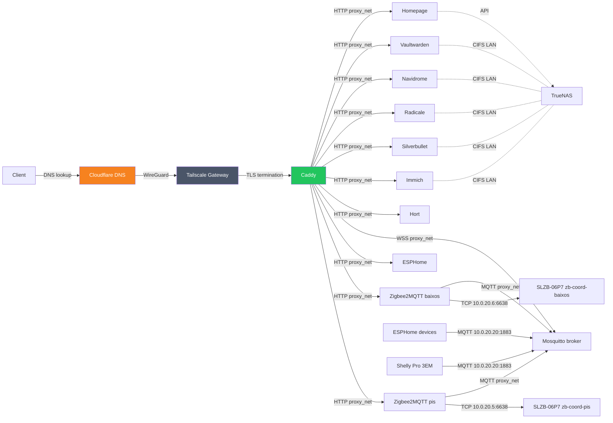

# 🏠 Homelab

Docker Compose homelab running behind Caddy (reverse proxy) and Tailscale (VPN). Backups and media are stored on TrueNAS via SMB/CIFS.

## 🏗️ Architecture


```mermaid
graph LR
    TS[Tailscale] --> Caddy

    subgraph VM["Proxmox VM"]
        subgraph proxy_net
            Caddy --> Homepage
            Caddy --> Vaultwarden
            Caddy --> Navidrome
            Caddy --> Radicale
            Caddy --> Silverbullet
            Caddy --> ImmichProxy[Immich Public Proxy]
            Caddy --> Hermes
            Caddy --> HermesWorkspace[Hermes Workspace]
            HermesWorkspace --> Hermes
            Caddy --> Hort
            ImmichProxy --> Immich[Immich]
            Homepage -->|TCP 2375| DockerProxy[Docker Socket Proxy]
            DockerProxy -.->|Docker socket| Caddy
            DockerProxy -.->|Docker socket| Vaultwarden
            DockerProxy -.->|Docker socket| Navidrome
            DockerProxy -.->|Docker socket| Radicale
            DockerProxy -.->|Docker socket| Silverbullet
            DockerProxy -.->|Docker socket| Immich
            DockerProxy -.->|Docker socket| Hermes
            DockerProxy -.->|Docker socket| HermesWorkspace
            DockerProxy -.->|Docker socket| Hort
            Vaultwarden -.- Backup[Backup Sidecar]
            Radicale -.- RadBackup[Backup Sidecar]
            Immich -.- ImmichBackup[Backup Sidecar]
            Hermes -.- HermesBackup[Backup Sidecar]
        end
    end

    subgraph NAS["TrueNAS (separate machine)"]
        backups["/backups (SMB)"]
        media["/media (SMB)"]
        photos["/photos (SMB)"]
    end

    Homepage -.->|API| TrueNAS

    Backup -->|CIFS| backups
    RadBackup -->|CIFS| backups
    ImmichBackup -->|CIFS| backups
    HermesBackup -->|CIFS| backups

    Navidrome -->|CIFS read-only| media
    Immich -->|CIFS read-write| photos
```

- 🌐 **Gateway** — Caddy with Cloudflare DNS-01 TLS, exposed via Tailscale sidecar. `cloudflared` tunnel exposes `share.<DOMAIN>` publicly without opening inbound ports. `caddy-watcher` automatically restarts Caddy whenever Tailscale restarts — necessary because Caddy uses `network_mode: service:tailscale` to share Tailscale's network namespace, and a Tailscale restart creates a new namespace that Caddy must rejoin.
- 🔐 **Security** — Vaultwarden with daily backup to TrueNAS
- 🎬 **Media** — Navidrome (music streaming), Immich (photo management), immich-public-proxy (public album sharing at `share.<DOMAIN>`)
- 📇 **Contacts** — Radicale CardDAV server for contacts sync with daily backup to TrueNAS
- 📝 **Notes** — Silverbullet web-native markdown wiki + WebDAV sync endpoint. Both share the same NAS notes vault (plain `.md` files). WebDAV enables Obsidian desktop/mobile sync via the [Remotely Save](https://github.com/remotely-save/remotely-save) community plugin.
- 🤖 **Hermes** — Personal AI agent (Nous Research Hermes Agent) migrated from local use, with Telegram bot + web dashboard at `hermes.<DOMAIN>`, daily backup to TrueNAS (no downtime). [Hermes Workspace](https://github.com/outsourc-e/hermes-workspace) at `workspace.<DOMAIN>` adds a full UI on top of the same agent (chat, file browser, terminal, skills/memory management) — it shares the `agent_data` volume and talks to the agent's gateway API (:8642, token-protected via `HERMES_API_KEY`) and dashboard API (:9119); workspace login uses `HERMES_WORKSPACE_PASSWORD`. Known limitation: the hermes dashboard's `basic_auth` (which hermes *requires* on non-loopback binds — there is no unauthenticated option) blocks the workspace from scraping a dashboard session token, so dashboard-token features (session kanban, context usage) run degraded; chat, files, skills, and memory work fully via the gateway API. Fixing this would require binding the dashboard to loopback and sharing hermes's network namespace, at the cost of the standalone `hermes.<DOMAIN>` UI.
- 🔀 **CPA** — [CLIProxyAPI](https://github.com/router-for-me/CLIProxyAPI), one shared LLM proxy for all coding agents (pi, Claude, Codex), at `cpa.<DOMAIN>`. Fronts OAuth providers (Antigravity Gemini, Claude) and OpenAI-compatible upstreams (OpenRouter → GLM) behind a single API key, so agents point at one endpoint instead of juggling per-provider creds. [cpa-usage-keeper](https://github.com/willxup/cpa-usage-keeper) ingests CPA's Redis RESP usage queue and serves a usage dashboard at `usage.<DOMAIN>` (login via `KEEPER_LOGIN_PASSWORD`); it reaches CPA's management API with `CPA_MANAGEMENT_KEY` (the plaintext of `config.yaml`'s `secret-key`). Daily backup of `auths/` (OAuth tokens) + keeper DB to TrueNAS. **OAuth logins are done off-box:** the panel/CLI callback binds a loopback redirect to the proxy's own port, which doesn't resolve against a headless host — so log in locally, then `scp` the resulting `auths/*.json` (each carries a `refresh_token`, so CPA auto-refreshes indefinitely with no further callbacks). Config lives in `config.yaml` (gitignored — holds the mgmt key, client API key, and OpenRouter key); recreate it from `config.example.yaml`. Also mirrored in the [agent-station](https://github.com/masolnada/agent-station) repo for local dev.
- 🌱 **Garden** — Hort, the dashboard for the [automated fertigation system](https://github.com/masolnada/automated-fertigation-system), at `hort.<DOMAIN>`. Static page (nginx) built straight from that repo's `dashboard/` directory; talks MQTT-over-WebSockets from the browser to the Mosquitto broker via `mqtt.<DOMAIN>` (Caddy proxies wss to `mosquitto:9001` — an HTTPS page cannot open plain `ws://`). Stateless, so no backup sidecar.
- 🏡 **Automation** — Mosquitto MQTT broker + ESPHome dashboard, migrated from the retired gordi NixOS VM (July 2026). Mosquitto listens on 1883 (plain MQTT, published on the host) and 9001 (websockets, proxied as `mqtt.<DOMAIN>`). The homelab VM carries **10.0.20.20 as a secondary IP** (netplan overlay `/etc/netplan/60-mqtt-vip.yaml`) — the old gordi broker address that every ESPHome device has baked in, so nothing needed reflashing. ESPHome dashboard at `esphome.<DOMAIN>` uses ping (not mDNS) for device reachability. Node-RED and n8n from gordi were retired; a data backup lives at `pve:/root/gordi-migration-backup.tar.gz`. Two Zigbee2MQTT instances (`z2m-baixos` and `z2m-pis`) each drive an SLZB-06P7 network coordinator — "zb-coord-baixos" at `10.0.20.6:6638` and "zb-coord-pis" at `10.0.20.5:6638` (zstack over TCP — no USB passthrough). Frontends at `z2m-baixos.<DOMAIN>` / `z2m-pis.<DOMAIN>`, publishing raw JSON to `zigbee2mqtt-baixos/#` / `zigbee2mqtt-pis/#` on Mosquitto (Home Assistant discovery disabled). The networks use distinct radio channels (baixos on the default 11, pis pinned to 15) and distinct `Z2M_<NAME>_*` identity values. State (device DB, network config) lives in the `z2m_baixos_data` / `z2m_pis_data` volumes — no backup sidecar yet, so keep the `Z2M_*` network identity values safe. Sensor history is captured by **Telegraf → InfluxDB 2 → Grafana**: Telegraf subscribes to `zigbee2mqtt-baixos/+` and `zigbee2mqtt-pis/+` (single-level wildcard, so bridge and availability topics are skipped) and writes every device report to the `zigbee` bucket as measurement `zigbee`, tagged `base_topic` and `device`. It uses the classic JSON parser, which keeps numeric values and **drops strings and booleans silently** — deliberate, since it guarantees every field is a float and no device can cause a type conflict; capturing `action` / `contact` / `occupancy` later needs `json_string_fields` plus an enum processor in `automation/telegraf/telegraf.conf`. A **Shelly Pro 3EM** three-phase CT meter feeds the same pipeline over stock Shelly firmware (no ESPHome) — see [⚡ Energy Metering](#-energy-metering). **ring-mqtt** bridges a Ring intercom/doorbell to MQTT so bell/motion events can drive automations — see [Ring Intercom](#-ring-intercom-ring-mqtt) below for the one-time auth setup. It's internal to `proxy_net` with no Caddy route (no persistent web UI — auth is a one-off CLI step) and no backup sidecar; its `ring_data` volume holds `config.json` and the self-rotating refresh token. Grafana at `grafana.<DOMAIN>` provisions its InfluxDB datasource (Flux) and dashboards from git under `automation/grafana/` — dashboard JSON hard-codes the bucket name, so it must match `INFLUXDB_BUCKET`. InfluxDB and Telegraf are internal to `proxy_net` with no Caddy route. `INFLUXDB_*` and `GRAFANA_ADMIN_*` only take effect on first boot (empty `influxdb_data` / `grafana_data` volume); no backup sidecars.
- 📊 **Dashboard** — Homepage at `home.<DOMAIN>` with greeting, weather (Cardona & Barcelona via Open-Meteo), server resources, service status, and Docker stats (via socket proxy)

## 📂 NAS Share Structure

```
media/            ← SMB share (Navidrome)
└── music/        ← Navidrome library

photos/           ← SMB share (Immich upload library, read-write)

notes/            ← SMB share (Silverbullet markdown vault, read-write)
```

## 🌐 Network Flow


```mermaid
graph LR
    Client -->|DNS lookup| CF[Cloudflare DNS]
    CF -->|WireGuard| TS[Tailscale Gateway]
    TS -->|TLS termination| Caddy
    Caddy -->|HTTP proxy_net| Homepage
    Caddy -->|HTTP proxy_net| Vaultwarden
    Caddy -->|HTTP proxy_net| Navidrome
    Caddy -->|HTTP proxy_net| Radicale
    Caddy -->|HTTP proxy_net| Silverbullet
    Caddy -->|HTTP proxy_net| Immich
    Caddy -->|HTTP proxy_net| Hort
    Caddy -->|WSS proxy_net| Mosquitto[Mosquitto broker]
    Caddy -->|HTTP proxy_net| ESPHome
    Caddy -->|HTTP proxy_net| Z2M[Zigbee2MQTT baixos]
    Z2M -->|MQTT proxy_net| Mosquitto
    Z2M -->|TCP 10.0.20.6:6638| Coord[SLZB-06P7 zb-coord-baixos]
    Caddy -->|HTTP proxy_net| Z2MPis[Zigbee2MQTT pis]
    Z2MPis -->|MQTT proxy_net| Mosquitto
    Z2MPis -->|TCP 10.0.20.5:6638| CoordPis[SLZB-06P7 zb-coord-pis]
    Devices[ESPHome devices] -->|MQTT 10.0.20.20:1883| Mosquitto
    Shelly[Shelly Pro 3EM] -->|MQTT 10.0.20.20:1883| Mosquitto
    Homepage -.->|API| NAS[TrueNAS]
    Vaultwarden -.-|CIFS LAN| NAS
    Navidrome -.-|CIFS LAN| NAS
    Radicale -.-|CIFS LAN| NAS
    Silverbullet -.-|CIFS LAN| NAS
    Immich -.-|CIFS LAN| NAS

    style CF fill:#f6821f,color:#fff
    style TS fill:#4a5568,color:#fff
    style Caddy fill:#22c55e,color:#fff
```

- **External**: encrypted via Tailscale (WireGuard) + Caddy (Let's Encrypt TLS)
- **Internal**: plain HTTP over Docker's `proxy_net` — never leaves the host
- **NAS**: direct LAN connection via CIFS, no Tailscale routing

## 📋 Prerequisites

- A Proxmox server
- A TrueNAS server with SMB shares configured
- A Cloudflare account managing your domain's DNS
- A Tailscale account

## 🖥️ VM Creation (from Proxmox host)

Run this from any machine with the repo cloned, via SSH to the Proxmox host:

```bash
ssh root@<proxmox-ip> "SSH_PUB_KEY='$(cat ~/.ssh/id_infra_v2.pub)' bash -s" < create-vm.sh
```

Or with custom variables:

```bash
ssh root@<proxmox-ip> "SSH_PUB_KEY='$(cat ~/.ssh/id_infra_v2.pub)' VMID=300 CORES=8 bash -s" < create-vm.sh
```

This downloads an Ubuntu 24.04 cloud image, creates the VM, and uses cloud-init to automatically install Docker, Tailscale, git, and cifs-utils, then clones the repo and runs `init.sh`.

Override defaults with environment variables:

| Variable | Default | Description |
|---|---|---|
| `VMID` | `200` | Proxmox VM ID |
| `VM_NAME` | `homelab` | VM name |
| `CORES` | `4` | CPU cores |
| `MEMORY` | `4096` | RAM in MB |
| `DISK_SIZE` | `32G` | Disk size |
| `STORAGE` | `local-lvm` | Proxmox storage pool |
| `BRIDGE` | `vmbr0` | Network bridge |
| `VLAN_TAG` | `20` | VLAN tag for the VM network |
| `VM_USER` | `ubuntu` | VM login username |
| `SSH_PUB_KEY` | *(required)* | SSH public key content (e.g. `$(cat ~/.ssh/id_infra_v2.pub)`) |

```bash
# Example: custom VM ID with more resources
ssh root@<proxmox-ip> "SSH_PUB_KEY='$(cat ~/.ssh/id_infra_v2.pub)' VMID=300 CORES=8 MEMORY=8192 bash -s" < create-vm.sh
```

## 🚀 Setup (inside the VM)

After the VM boots, SSH in and complete the remaining manual steps:

### 1. Authenticate Tailscale

```bash
tailscale up
```

### 2. Configure environment variables

Edit each stack's `.env` file in `/opt/homelab/` with your credentials:

**gateway/.env**

| Variable | Description |
|---|---|
| `DOMAIN` | Your base domain (e.g. `life.marcsolanadal.com`) |
| `CLOUDFLARE_API_TOKEN` | API token — create at My Profile > API Tokens > **Edit zone DNS** template, scoped to your domain's zone |

> **Warning**: The Cloudflare API token must have both **Zone:DNS:Edit** and **Zone:Zone:Read** permissions, scoped to your domain's zone. Without these, Caddy's DNS-01 challenge will fail with "timed out waiting for record to fully propagate".

> **Note**: If certificate issuance fails repeatedly, check for stale `_acme-challenge` TXT records in Cloudflare DNS. Duplicate records from previous failed attempts can block propagation. Delete them manually in the Cloudflare dashboard (or via API), then restart Caddy with a clean volume: `docker volume rm gateway_caddy_data`.
| `TAILSCALE_AUTHKEY` | Tailscale auth key (generate at Tailscale admin console > Settings > Keys) |

**security/.env**

| Variable | Description |
|---|---|
| `TIMEZONE` | Timezone (e.g. `Europe/Madrid`) |
| `VAULTWARDEN_ADMIN_TOKEN` | Admin panel token — generate with `openssl rand -base64 48` |
| `NAS_IP` | TrueNAS IP address |
| `NAS_BACKUP_SHARE` | SMB share name for backups |
| `NAS_BACKUP_USER` | NAS user for backup share |
| `NAS_BACKUP_PASSWORD` | NAS password for backup share |

**media/.env**

| Variable | Description |
|---|---|
| `TIMEZONE` | Timezone (e.g. `Europe/Madrid`) |
| `NAS_IP` | TrueNAS IP address |
| `NAS_MEDIA_SHARE` | SMB share name for the media share (e.g. `media`) |
| `NAS_MEDIA_USER` | NAS user for media share |
| `NAS_MEDIA_PASSWORD` | NAS password for media share |
| `IMMICH_VERSION` | Immich image tag (default: `release`) |
| `IMMICH_DB_USER` | Postgres username for Immich (e.g. `immich`) |
| `IMMICH_DB_PASSWORD` | Postgres password — generate with `openssl rand -base64 32` |
| `IMMICH_DB_NAME` | Postgres database name (e.g. `immich`) |
| `NAS_PHOTOS_SHARE` | SMB share name for the Immich photo library (e.g. `photos`) |
| `NAS_PHOTOS_USER` | NAS user for photos share (read-write) |
| `NAS_PHOTOS_PASSWORD` | NAS password for photos share |
| `NAS_BACKUP_SHARE` | SMB share name for backups |
| `NAS_BACKUP_USER` | NAS user for backup share |
| `NAS_BACKUP_PASSWORD` | NAS password for backup share |

**contacts/.env**

| Variable | Description |
|---|---|
| `TIMEZONE` | Timezone (e.g. `Europe/Madrid`) |
| `NAS_IP` | TrueNAS IP address |
| `NAS_BACKUP_SHARE` | SMB share name for backups |
| `NAS_BACKUP_USER` | NAS user for backup share |
| `NAS_BACKUP_PASSWORD` | NAS password for backup share |

**notes/.env**

| Variable | Description |
|---|---|
| `NAS_IP` | TrueNAS IP address |
| `NAS_NOTES_SHARE` | SMB share name for the notes vault (e.g. `notes`) |
| `NAS_NOTES_USER` | NAS user for notes share |
| `NAS_NOTES_PASSWORD` | NAS password for notes share |
| `SB_USER` | Silverbullet login in `username:password` format (e.g. `admin:yourpassword`) |
| `WEBDAV_USER` | WebDAV username for Obsidian sync |
| `WEBDAV_PASSWORD` | WebDAV password for Obsidian sync |

**agent/.env**

| Variable | Description |
|---|---|
| `TIMEZONE` | Timezone (e.g. `Europe/Madrid`) |
| `NAS_IP` | TrueNAS IP address |
| `NAS_BACKUP_SHARE` | SMB share name for backups |
| `NAS_BACKUP_USER` | NAS user for backup share |
| `NAS_BACKUP_PASSWORD` | NAS password for backup share |
| `HERMES_API_KEY` | Token for the agent's gateway API (:8642) — shared between the `hermes` and `workspace` containers |
| `HERMES_WORKSPACE_PASSWORD` | Login password for the Hermes Workspace UI at `workspace.<DOMAIN>` |

> **Note**: this stack's `.env` only holds deployment-level config (timezone, backup share). Model provider keys (Anthropic, GLM/Z.AI, Kimi, Telegram bot token, etc.) and all agent state (memories, SOUL.md, skills, sessions) live inside the `agent_data` volume at `/opt/data/.env` and `/opt/data/config.yaml` — this agent was migrated from an existing local Hermes install rather than configured from scratch, so its provider setup and personality carry over as-is. Run `docker exec -it hermes hermes model` to change providers.

**cpa/.env**

| Variable | Description |
|---|---|
| `TIMEZONE` | Timezone (e.g. `Europe/Madrid`) |
| `CPA_MANAGEMENT_KEY` | Plaintext of `config.yaml`'s `remote-management.secret-key` — keeper uses it to read CPA's management/usage API |
| `KEEPER_LOGIN_PASSWORD` | Login password for the usage dashboard at `usage.<DOMAIN>` |
| `NAS_IP` | TrueNAS IP address |
| `NAS_BACKUP_SHARE` | SMB share name for backups |
| `NAS_BACKUP_USER` | NAS user for backup share |
| `NAS_BACKUP_PASSWORD` | NAS password for backup share |

> **Note**: the LLM provider credentials (management key, `sk-local-…` client key, OpenRouter key) live in `cpa/config.yaml` (gitignored), not `.env`. Copy `config.example.yaml` → `config.yaml` and fill them in on the server. OAuth tokens are dropped into `cpa/auths/` by `scp`-ing them from a local login (see the CPA bullet above).

**garden/.env**

| Variable | Description |
|---|---|
| `DOMAIN` | Your base domain (e.g. `life.marcsolanadal.com`) — used to build the `wss://mqtt.<DOMAIN>` broker URL |
| `MQTT_USERNAME` | Mosquitto broker username |
| `MQTT_PASSWORD` | Mosquitto broker password |

> **Note**: the MQTT credentials are rendered into the page's `config.js` at container start and are readable by anyone who can load the dashboard. That's the whole Tailnet — treat the `hort.<DOMAIN>` URL with the same trust as the broker itself.

**automation/.env**

| Variable | Description |
|---|---|
| `TIMEZONE` | Timezone (e.g. `Europe/Madrid`) |
| `MQTT_USERNAME` | Mosquitto username — the container renders its password file from these at start |
| `MQTT_PASSWORD` | Mosquitto password (same values the ESPHome devices, the hort dashboard, and Zigbee2MQTT use) |
| `RING_LOCATION_ID` | Ring location UUID — build the ring-mqtt topics for the `mqtt-rules` sidecar. From `docker logs ring-mqtt` ("New location:") |
| `RING_INTERCOM_ID` | Ring intercom device ID — same source ("New device:"). Both change if the intercom is re-added to the account |
| `Z2M_BAIXOS_NETWORK_KEY` | Zigbee network key, 16-byte array without spaces (e.g. `[13,42,...]`) — **generate once, never change after pairing devices** (changing it orphans the whole network) |
| `Z2M_BAIXOS_PAN_ID` | Zigbee PAN ID, decimal `1`–`65527` (hex is rejected — the env value is JSON-parsed), unique per coordinator — same generate-once warning |
| `Z2M_BAIXOS_EXT_PAN_ID` | Zigbee extended PAN ID, 8-byte array without spaces, unique per coordinator — same generate-once warning |
| `Z2M_PIS_NETWORK_KEY` | Same as `Z2M_BAIXOS_NETWORK_KEY`, for the zb-coord-pis network — unique value |
| `Z2M_PIS_PAN_ID` | Same as `Z2M_BAIXOS_PAN_ID`, for the zb-coord-pis network — unique value |
| `Z2M_PIS_EXT_PAN_ID` | Same as `Z2M_BAIXOS_EXT_PAN_ID`, for the zb-coord-pis network — unique value |

**dashboard/.env**

| Variable | Description |
|---|---|
| `DOMAIN` | Your base domain (e.g. `life.marcsolanadal.com`) |
| `NAVIDROME_USER` | Navidrome username (for the Subsonic API widget) |
| `NAVIDROME_TOKEN` | `md5(password + salt)` — see [Subsonic API docs](http://www.subsonic.org/pages/api.jsp) |
| `NAVIDROME_SALT` | Random salt string (e.g. `openssl rand -hex 8`) |
| `TRUENAS_IP` | TrueNAS IP or hostname (e.g. `nas.home.lab`) |
| `TRUENAS_KEY` | TrueNAS API key — generate at TrueNAS UI → user icon → **API Keys** → **Add** |
| `IMMICH_API_KEY` | Immich API key — generate at Immich UI → Account Settings → **API Keys** |

> **Note**: The Navidrome widget uses the Subsonic API token auth scheme. The token is **not** your password — it's `md5(password + salt)`. Generate it with: `echo -n "yourpassword$(openssl rand -hex 8)" | md5sum`

> **Note**: Homepage requires `HOMEPAGE_ALLOWED_HOSTS` to match the hostname in the request. This is set automatically from `DOMAIN` in the compose file. If you see 403 errors, check this value matches your subdomain.

> **Note**: The Caddy admin API is enabled via `CADDY_ADMIN=:2019` in the gateway compose file. This binds to all interfaces inside the container (needed because Caddy uses `network_mode: service:tailscale`). It's only reachable from other containers on `proxy_net` as `tailscale-gateway:2019` — not exposed to the internet. The Homepage Caddy widget uses this to show upstream/request stats.

> **Note**: Homepage reads Docker container stats (CPU, memory, network) via a [Docker socket proxy](https://github.com/Tecnativa/docker-socket-proxy) instead of mounting the socket directly. The proxy only allows read access to containers, images, and networks — all write and dangerous endpoints (exec, commit, etc.) are denied by default. The host filesystem is mounted at `/host` (read-only) for disk usage metrics.

> **Note**: The TrueNAS widget connects to the TrueNAS REST API over the LAN (not via Tailscale). It shows load, uptime, alerts, and pool usage. The API key is scoped per-user — generate it from the TrueNAS web UI under your user's API Keys page.

### 3. DNS

A wildcard A record (`*.<DOMAIN>`) points directly to the server IP in Cloudflare. This avoids double-hopping through the Cloudflare proxy, which causes issues with Android clients. No per-service DNS changes needed — all subdomains resolve automatically.

### 4. Start the stacks

```bash
./start.sh
```

This starts gateway, security, media, contacts, notes, agent, cpa, garden, automation, and dashboard in order.

### 5. ✅ Verify

```bash
# Check Caddy TLS certificates
docker compose -f gateway/docker-compose.yml logs caddy

# Check Tailscale connectivity
docker exec tailscale-gateway tailscale status

# Check all containers are running
docker ps
```

## 💾 TrueNAS Setup

Before starting the stacks, make sure your TrueNAS server has:

1. **SMB shares** — a backup share for Vaultwarden/Radicale/Immich, a media share with a music subdirectory for Navidrome, and a photos share for Immich
2. **Dedicated users** — a backup user (read/write), a media user (read-only for Navidrome), and a photos user (read/write for Immich)
3. **CIFS utils installed** on the VM: `sudo apt install cifs-utils`

## ➕ Adding a New Service

To expose a service running on a different Proxmox VM (e.g. `192.168.1.50:8080`), add a block to `gateway/Caddyfile`:

```
myapp.{$DOMAIN} {
    reverse_proxy 192.168.1.50:8080
    import cloudflare
}
```

Then reload Caddy:

```bash
docker exec caddy caddy reload --config /etc/caddy/Caddyfile
```

## 📝 Notes (Obsidian + SilverBullet)

The `notes/` stack exposes the same NAS vault (plain `.md` files) through two interfaces:

| Interface | URL | Use case |
|---|---|---|
| SilverBullet | `https://notes.<DOMAIN>` | Web browser editing |
| WebDAV | `https://webdav.<DOMAIN>` | Obsidian desktop & mobile sync |

### Connecting Obsidian via WebDAV

1. In Obsidian, open **Settings → Community plugins → Browse** and install **Remotely Save**
2. Enable the plugin and open its settings
3. Choose **WebDAV** as the remote service
4. Set the server address to `https://webdav.<DOMAIN>`
5. Enter your `WEBDAV_USER` and `WEBDAV_PASSWORD`
6. Set the remote base directory to `/` (or leave blank)
7. Tap **Check** to verify the connection, then **Sync**

> **Note**: `notes/webdav.yaml` uses `${WEBDAV_USER}` / `${WEBDAV_PASSWORD}` placeholders that hacdias/webdav expands from the container environment. If your version does not support env var expansion in the config file, replace the placeholders with literal values directly in the file on the server.

## 📸 Immich Public Sharing

`immich-public-proxy` exposes public album/photo share links at `share.<DOMAIN>` without requiring Immich credentials. Traffic reaches it via a Cloudflare Tunnel (`cloudflared` sidecar in the gateway stack), so no inbound ports are opened on the router.

### Setup

**1. Create a Cloudflare Tunnel**

Go to [Cloudflare Zero Trust](https://one.dash.cloudflare.com) → Networks → Tunnels → Create a tunnel. Copy the token from the connector install step and add it to `gateway/.env`:

```
CLOUDFLARE_TUNNEL_TOKEN=<token>
```

**2. Configure a public hostname**

In the tunnel → **Published applications** → Add:

| Field | Value |
|---|---|
| Subdomain | `share` |
| Domain | your domain |
| Service type | `HTTP` |
| URL | `immich-public-proxy:3000` |

Cloudflare automatically creates a DNS record for `share.<DOMAIN>` pointing to the tunnel. The existing wildcard A record (Tailscale) is overridden for this subdomain only.

**3. Set the external domain in Immich**

Immich admin → Server Settings → External domain → `https://share.<DOMAIN>`

This makes Immich embed the proxy URL in generated share links.

## ⚡ Energy Metering

A **Shelly Pro 3EM** (`shellypro3em-34987a44fb48`) on the consumer unit measures three circuits with clamp-on CTs. It runs **stock Shelly firmware**, not ESPHome — it is configured from its own web UI, so nothing about it lives in the `my-esphome` repo. It only needs to point at the broker.

### Broker settings (Shelly UI → Networks → MQTT)

| Field | Value |
|---|---|
| Server | `10.0.20.20:1883` |
| Client ID | `shellypro3em-34987a44fb48` (leave as the factory default — it must be unique on the broker) |
| Username / Password | the same `MQTT_USERNAME` / `MQTT_PASSWORD` as every other device |

> **Note**: "Enable `RPC over MQTT`" must stay on — the status topics below are part of the Gen2 RPC schema.

### Channel assignment

| Channel | Circuit | Notes |
|---|---|---|
| **A** | Whole-flat consumption | The main incomer — everything else is a subset of this |
| **B** | Fireplace fan | |
| **C** | Water heater | |

Channel identity is purely physical: it is which CT clamp is on which conductor, and which voltage terminal is landed. Nothing in software asserts it, so **if the clamps are ever moved, the dashboard labels silently become wrong.**

Because the same three channels repeat across every panel, the dashboard JSON is generated rather than hand-edited — the labels and colours live in one `CHANNELS` table instead of being restated nine times:

```bash
# edit the CHANNELS table at the top, then:
python3 automation/grafana/shelly-pro-3em.gen.py > automation/grafana/dashboards/shelly-pro-3em.json
```

Grafana's file provider picks the change up within ~30 s — no restart. (The older `marcscave-temp-sensor.json` predates this and is still hand-maintained; both styles work, since only the JSON is provisioned.)

### Topics and storage

The Shelly publishes its own Gen2 schema, which is neither zigbee2mqtt's nor ESPHome's, so it gets its own `[[inputs.mqtt_consumer]]` blocks in `automation/telegraf/telegraf.conf`:

| Topic | Cadence | Measurement | Contents |
|---|---|---|---|
| `<device>/status/em:0` | every internal sample (sub-second) | `shelly_em` | Instantaneous gauges: `{a,b,c}_{act_power,aprt_power,current,voltage,pf,freq}` plus `total_*` |
| `<device>/status/emdata:0` | every 60 s | `shelly_emdata` | Monotonic lifetime counters in **watt-hours**: `{a,b,c}_total_act_energy` and `_ret_energy` |

Both are tagged `device`. Telegraf's classic JSON parser drops `n_current` (null — no neutral clamp fitted) and `user_calibrated_phase` (an array); `id` is dropped explicitly since it is the component index, not a reading.

The two are kept in **separate measurements on purpose**: mixing monotonic totals with gauges makes any "select all fields" panel meaningless. Per-period consumption is derived from the counters with `difference(nonNegative: true)` rather than by integrating the power series, so Telegraf restarts and scrape gaps cannot corrupt the total.

### Dashboard

`Energy — Shelly Pro 3EM` at `grafana.<DOMAIN>/d/shelly-pro-3em` — stat tiles for current draw, active power by channel, energy per hour, power factor, and voltage/current diagnostics.

### Troubleshooting a dead channel

The voltage and current panels exist for this. A healthy channel sits near 230 V with current that tracks the load; the two failure modes look quite different:

| Symptom | Meaning | Fix |
|---|---|---|
| Voltage ~230 V, current pinned at a few tens of mA, power flat 0 W, lifetime counter frozen | The CT clamp is not sensing a conductor | Check it is plugged into the right jack, clicked fully shut, and around **one** conductor — a clamp around live *and* neutral together reads zero, since the currents cancel |
| Voltage near 0 V (single-digit — a floating input) | That channel's voltage terminal is not landed on a live conductor | The meter cannot compute power without a voltage reference, however well the CT is fitted. Land the voltage wire |

A quick way to tell a real reading from a stuck one, without waiting for the dashboard:

```bash
docker exec mosquitto mosquitto_sub -h localhost -u "$MQTT_USERNAME" -P "$MQTT_PASSWORD" \
  -t 'shellypro3em-34987a44fb48/status/emdata:0' -v
```

Each line is a minute apart. A working channel's `*_total_act_energy` climbs by roughly `watts / 60` Wh per line; a dead one repeats the same number forever.

> **Sanity check**: a resistive load (a heater element) should show a power factor near 1.0. A channel labelled as a heater but reading ~0.8 is probably sharing its circuit with a motor or a switch-mode supply — or is not the circuit you think it is.

## 🔄 Backups

Vaultwarden, Radicale, Immich, and Hermes are backed up daily at 03:00 AM to the TrueNAS SMB share. Each backup sidecar:

- Retains 30 days of backups with automatic rotation
- Stores backups as `<service>-<timestamp>.tar.gz`

Vaultwarden, Radicale, and Immich stop their application container during backup to guarantee a consistent snapshot. **Hermes is the exception** — it stays running during backup (a live copy of `/opt/data`), a deliberate tradeoff to avoid interrupting the agent; there's a small residual risk of catching a file mid-write. The Hermes backup archive also includes the `workspace_files` volume (the Workspace UI's `/workspace` working directory).

**Immich backup strategy:**
- The **postgres database** (metadata, albums, faces) is backed up daily via the backup sidecar to `backups/immich/` on the NAS
- The **photo library** lives on the dedicated `photos` NAS share; incremental backups are handled at the NAS level via TrueNAS ZFS snapshots

## 📇 Contacts (CardDAV)

Radicale provides CardDAV contacts sync at `contacts.<DOMAIN>`. The web UI lets you create address books and manage contacts directly.

**CardDAV URL**: `https://contacts.<DOMAIN>/<username>/<address-book>/`

### Client Setup

> **Important**: Use `contacts.<DOMAIN>/<username>/` as the server path (not just the domain). Clients need the principal path to discover address books correctly.

- **iOS**: Settings → Contacts → Accounts → Add Account → Other → Add CardDAV Account. Server: `contacts.<DOMAIN>/<username>/`, then enter your username and password.
- **Android (DAVx5)**: Install [DAVx5](https://www.davx5.com/), add account with base URL `https://contacts.<DOMAIN>/<username>/`, enter your username and password.
- **macOS**: System Settings → Internet Accounts → Add Other Account → CardDAV. Server: `contacts.<DOMAIN>/<username>/`.

## 🔔 Ring Intercom (ring-mqtt)

[ring-mqtt](https://github.com/tsightler/ring-mqtt) bridges a Ring account (intercom, doorbells, alarm, etc.) to MQTT so bell/motion/lock events can drive automations. It runs in the `automation/` stack alongside Mosquitto.

**Auth model — read this before assuming you need a cron job:** ring-mqtt authenticates once via a refresh token and **rotates that token itself on every use**, rewriting it into `ring-state.json` inside the `ring_data` volume. There is no env-var token and nothing to refresh manually or on a schedule — that pattern actively hurts, since repeatedly hitting the Ring API with a stale/invalid token can get the homelab's IP temporarily blocked. The only real failure mode is losing `/data` (e.g. running the container without the volume, or on a fresh volume), which throws away the token and forces re-auth.

### Setup

**1. Enable cameras/chimes support (required for intercoms)**

Ring Intercom is classified as a camera-family device and needs `enable_cameras: true` in `config.json` — see step 2.

**2. One-time interactive authentication**

Run the bundled CLI tool against the same named volume the main container will use, from the homelab server:

```bash
docker run -it --rm -v automation_ring_data:/data \
  --entrypoint /app/ring-mqtt/init-ring-mqtt.js tsightler/ring-mqtt:5.9.3
```

Enter your Ring account email/password and 2FA code when prompted. This writes `config.json` and `ring-state.json` (with the refresh token) into the volume. If the volume doesn't exist yet, Docker creates it — just make sure the name matches what compose will use (`<project>_ring_data`, i.e. `automation_ring_data` for this repo's default project name).

**3. Point it at Mosquitto**

Edit `config.json` in the volume (e.g. `docker run -it --rm -v automation_ring_data:/data --entrypoint vi tsightler/ring-mqtt:5.9.3 /data/config.json`) and set:

```json
"mqtt_url": "mqtt://<MQTT_USERNAME>:<MQTT_PASSWORD>@mosquitto:1883"
```

using the same credentials as `automation/.env`. URL-encode any special characters in the password.

**4. Start the container**

```bash
sudo docker compose -f automation/docker-compose.yml up -d ring-mqtt
```

**Topics**: events publish under `ring/<location_id>/camera/<device_id>/...` — e.g. `ding/state` (ON = bell pressed), `motion/state`, and for intercoms `lock/state` / the unlock command topic. Full topic reference in the [ring-mqtt wiki](https://github.com/tsightler/ring-mqtt/wiki/MQTT-Device-Topics).

**Re-authenticating** (only needed if the volume is lost, or Ring revokes the session): stop the container, repeat step 2, then start it again. If push/state updates silently stop working for *all* devices and a restart doesn't fix it, the wiki's troubleshooting guide recommends removing the stale "Authorized Client Device" from Ring's Control Center before re-authenticating — otherwise stale device registrations pile up and can degrade push delivery further.

**RTSP streaming**: not enabled — this setup only covers events for automations. The Ring Intercom hardware itself has no camera anyway; if a future doorbell/camera needs live view, add `ports: ["8554:8554"]` plus `livestream_user`/`livestream_pass` in `config.json`.

## 🔀 MQTT Rules (mqtt-rules)

There is no Node-RED or Home Assistant in this homelab, so the two standing automations live in a `mqtt-rules` sidecar in the `automation/` stack: a `mosquitto_sub` loop that dispatches to `mosquitto_pub`. It reuses the `eclipse-mosquitto` image already in the stack — no custom build, no language runtime, and the whole rule set is readable in `automation/docker-compose.yml`.

| Rule | Trigger | Action |
|---|---|---|
| **Unlock entrance** | `zigbee2mqtt-pis/entrance-button` publishes any `action` (`single`, `double`, `triple`, `quadruple`, `hold`) | `UNLOCK` → `ring/<loc>/intercom/<dev>/lock/command` |
| **Basement chime** | `ring/<loc>/intercom/<dev>/ding/state` publishes `ON` (15 s cooldown) | epoch timestamp → `timbre_baixos/ring` (the ESPHome Shelly 1 strikes the gong twice, ~1 s each) |

`RING_LOCATION_ID` / `RING_INTERCOM_ID` come from `automation/.env` and build both Ring topics.

### Why the rules look defensive

Three properties of the upstream topics shape the rules, and all three are load-bearing:

- **Neither trigger topic is retained.** Verified both ways: subscribing to `ring/#` fresh yields nothing, and ring-mqtt sets no retain flag anywhere in its source (only the `homeassistant/…` discovery configs on the broker are retained, and those come from z2m). z2m likewise does not retain the button topic. Nothing is replayed at subscribe time, so the rules need no grace window — and both subscriptions deliberately use a **clean session**: a doorbell press is a real-time event, and one that happened while the sidecar was down must never ring the bell later.
- **ring-mqtt publishes the ding edge-only and never republishes it.** `processDing()` sets `ON`, then clears to `OFF` from a 20 s `setTimeout`; `publishDingState()` only publishes on a change. So the rule must not depend on having seen the `OFF` — an earlier version tracked the previous state, and a single missed `OFF` would have wedged the chime off *permanently and silently*. It now chimes on any `ON` with a **15 s cooldown**: shorter than the 20 s auto-clear, so a genuine second ding still rings, and stateless, so nothing can wedge.
- **Both legs run at QoS 1.** Inbound so the broker retransmits a ding it could not hand over first time; outbound because timbre-baixos holds a persistent session, which lets mosquitto queue a ring across a Wi-Fi dropout. The queue is why the chime payload is the **publisher's epoch timestamp** rather than a fixed word: the bell drops any ring older than 30 s, so a queued one cannot wake the house minutes after whoever pressed the bell gave up. A non-timestamp payload (the device's web UI button, a hand-typed `mosquitto_pub`) has no age and always rings.

The unlock rule also ignores `action: "release"` (so a `hold` unlocks once, not twice — the WXKG11LM emits both) and empty `action` (z2m's clearing publish), plus a 3 s cooldown against duplicate presses.

> **Note**: `mosquitto_sub -R` is not a substitute for any of this. It suppresses *retained* messages, and there are none on these topics.

The shell variables are written `$$VAR` in the compose file so Compose passes them through to the shell instead of interpolating them itself.

### Changing or testing the rules

The logic is plain POSIX shell, so it can be exercised without touching the broker — feed synthetic `topic payload` lines into the same `while read` loop with `mosquitto_pub` stubbed out, and assert on what it would have published. Worth doing for any edit: this rule set can open the front door.

```bash
sudo docker logs mqtt-rules          # prints "unlock:" / "chime:" per fired rule

# The bell's own view — it logs every ring it receives at WARN, which is the
# only thing that distinguishes "never delivered" from "delivered, did not ring"
sudo docker exec mqtt-rules sh -c \
  'mosquitto_sub -h mosquitto -u $MQTT_USERNAME -P $MQTT_PASSWORD -v -t timbre-baixos/debug'
```

If the subscriber ever dies the container exits non-zero and `restart: unless-stopped` reconnects it.
