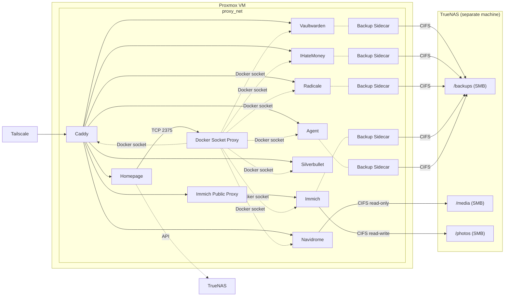
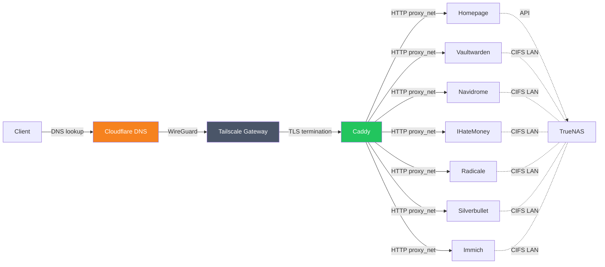

# 🏠 Homelab

Docker Compose homelab running behind Caddy (reverse proxy) and Tailscale (VPN). Backups and media are stored on TrueNAS via SMB/CIFS.

## 🏗️ Architecture


```mermaid
graph LR
    TS[Tailscale] --> Caddy

    subgraph VM["Proxmox VM"]
        subgraph proxy_net
            Caddy --> Homepage
            Caddy --> Vaultwarden
            Caddy --> Navidrome
            Caddy --> IHateMoney
            Caddy --> Radicale
            Caddy --> Silverbullet
            Caddy --> ImmichProxy[Immich Public Proxy]
            Caddy --> Agent
            ImmichProxy --> Immich[Immich]
            Homepage -->|TCP 2375| DockerProxy[Docker Socket Proxy]
            DockerProxy -.->|Docker socket| Caddy
            DockerProxy -.->|Docker socket| Vaultwarden
            DockerProxy -.->|Docker socket| Navidrome
            DockerProxy -.->|Docker socket| IHateMoney
            DockerProxy -.->|Docker socket| Radicale
            DockerProxy -.->|Docker socket| Silverbullet
            DockerProxy -.->|Docker socket| Immich
            DockerProxy -.->|Docker socket| Agent
            Vaultwarden -.- Backup[Backup Sidecar]
            IHateMoney -.- IHMBackup[Backup Sidecar]
            Radicale -.- RadBackup[Backup Sidecar]
            Immich -.- ImmichBackup[Backup Sidecar]
            Agent -.- AgentBackup[Backup Sidecar]
        end
    end

    subgraph NAS["TrueNAS (separate machine)"]
        backups["/backups (SMB)"]
        media["/media (SMB)"]
        photos["/photos (SMB)"]
    end

    Homepage -.->|API| TrueNAS

    Backup -->|CIFS| backups
    IHMBackup -->|CIFS| backups
    RadBackup -->|CIFS| backups
    ImmichBackup -->|CIFS| backups
    AgentBackup -->|CIFS| backups

    Navidrome -->|CIFS read-only| media
    Immich -->|CIFS read-write| photos
```

- 🌐 **Gateway** — Caddy with Cloudflare DNS-01 TLS, exposed via Tailscale sidecar. `cloudflared` tunnel exposes `share.<DOMAIN>` publicly without opening inbound ports. `caddy-watcher` automatically restarts Caddy whenever Tailscale restarts — necessary because Caddy uses `network_mode: service:tailscale` to share Tailscale's network namespace, and a Tailscale restart creates a new namespace that Caddy must rejoin.
- 🔐 **Security** — Vaultwarden with daily backup to TrueNAS
- 🎬 **Media** — Navidrome (music streaming), Immich (photo management), immich-public-proxy (public album sharing at `share.<DOMAIN>`)
- 💰 **Finance** — IHateMoney shared expense tracker with daily backup to TrueNAS
- 📇 **Contacts** — Radicale CardDAV server for contacts sync with daily backup to TrueNAS
- 📝 **Notes** — Silverbullet web-native markdown wiki + WebDAV sync endpoint. Both share the same NAS notes vault (plain `.md` files). WebDAV enables Obsidian desktop/mobile sync via the [Remotely Save](https://github.com/remotely-save/remotely-save) community plugin.
- 🤖 **Agent** — Personal AI agent (Nous Research Hermes Agent) migrated from local use, with Telegram bot + web dashboard at `agent.<DOMAIN>`, daily backup to TrueNAS (no downtime)
- 📊 **Dashboard** — Homepage at `home.<DOMAIN>` with greeting, weather (Cardona & Barcelona via Open-Meteo), server resources, service status, and Docker stats (via socket proxy)

## 📂 NAS Share Structure

```
media/            ← SMB share (Navidrome)
└── music/        ← Navidrome library

photos/           ← SMB share (Immich upload library, read-write)

notes/            ← SMB share (Silverbullet markdown vault, read-write)
```

## 🌐 Network Flow


```mermaid
graph LR
    Client -->|DNS lookup| CF[Cloudflare DNS]
    CF -->|WireGuard| TS[Tailscale Gateway]
    TS -->|TLS termination| Caddy
    Caddy -->|HTTP proxy_net| Homepage
    Caddy -->|HTTP proxy_net| Vaultwarden
    Caddy -->|HTTP proxy_net| Navidrome
    Caddy -->|HTTP proxy_net| IHateMoney
    Caddy -->|HTTP proxy_net| Radicale
    Caddy -->|HTTP proxy_net| Silverbullet
    Caddy -->|HTTP proxy_net| Immich
    Homepage -.->|API| NAS[TrueNAS]
    Vaultwarden -.-|CIFS LAN| NAS
    Navidrome -.-|CIFS LAN| NAS
    IHateMoney -.-|CIFS LAN| NAS
    Radicale -.-|CIFS LAN| NAS
    Silverbullet -.-|CIFS LAN| NAS
    Immich -.-|CIFS LAN| NAS

    style CF fill:#f6821f,color:#fff
    style TS fill:#4a5568,color:#fff
    style Caddy fill:#22c55e,color:#fff
```

- **External**: encrypted via Tailscale (WireGuard) + Caddy (Let's Encrypt TLS)
- **Internal**: plain HTTP over Docker's `proxy_net` — never leaves the host
- **NAS**: direct LAN connection via CIFS, no Tailscale routing

## 📋 Prerequisites

- A Proxmox server
- A TrueNAS server with SMB shares configured
- A Cloudflare account managing your domain's DNS
- A Tailscale account

## 🖥️ VM Creation (from Proxmox host)

Run this from any machine with the repo cloned, via SSH to the Proxmox host:

```bash
ssh root@<proxmox-ip> "SSH_PUB_KEY='$(cat ~/.ssh/id_infra_v2.pub)' bash -s" < create-vm.sh
```

Or with custom variables:

```bash
ssh root@<proxmox-ip> "SSH_PUB_KEY='$(cat ~/.ssh/id_infra_v2.pub)' VMID=300 CORES=8 bash -s" < create-vm.sh
```

This downloads an Ubuntu 24.04 cloud image, creates the VM, and uses cloud-init to automatically install Docker, Tailscale, git, and cifs-utils, then clones the repo and runs `init.sh`.

Override defaults with environment variables:

| Variable | Default | Description |
|---|---|---|
| `VMID` | `200` | Proxmox VM ID |
| `VM_NAME` | `homelab` | VM name |
| `CORES` | `4` | CPU cores |
| `MEMORY` | `4096` | RAM in MB |
| `DISK_SIZE` | `32G` | Disk size |
| `STORAGE` | `local-lvm` | Proxmox storage pool |
| `BRIDGE` | `vmbr0` | Network bridge |
| `VLAN_TAG` | `20` | VLAN tag for the VM network |
| `VM_USER` | `ubuntu` | VM login username |
| `SSH_PUB_KEY` | *(required)* | SSH public key content (e.g. `$(cat ~/.ssh/id_infra_v2.pub)`) |

```bash
# Example: custom VM ID with more resources
ssh root@<proxmox-ip> "SSH_PUB_KEY='$(cat ~/.ssh/id_infra_v2.pub)' VMID=300 CORES=8 MEMORY=8192 bash -s" < create-vm.sh
```

## 🚀 Setup (inside the VM)

After the VM boots, SSH in and complete the remaining manual steps:

### 1. Authenticate Tailscale

```bash
tailscale up
```

### 2. Configure environment variables

Edit each stack's `.env` file in `/opt/homelab/` with your credentials:

**gateway/.env**

| Variable | Description |
|---|---|
| `DOMAIN` | Your base domain (e.g. `life.marcsolanadal.com`) |
| `CLOUDFLARE_API_TOKEN` | API token — create at My Profile > API Tokens > **Edit zone DNS** template, scoped to your domain's zone |

> **Warning**: The Cloudflare API token must have both **Zone:DNS:Edit** and **Zone:Zone:Read** permissions, scoped to your domain's zone. Without these, Caddy's DNS-01 challenge will fail with "timed out waiting for record to fully propagate".

> **Note**: If certificate issuance fails repeatedly, check for stale `_acme-challenge` TXT records in Cloudflare DNS. Duplicate records from previous failed attempts can block propagation. Delete them manually in the Cloudflare dashboard (or via API), then restart Caddy with a clean volume: `docker volume rm gateway_caddy_data`.
| `TAILSCALE_AUTHKEY` | Tailscale auth key (generate at Tailscale admin console > Settings > Keys) |

**security/.env**

| Variable | Description |
|---|---|
| `TIMEZONE` | Timezone (e.g. `Europe/Madrid`) |
| `VAULTWARDEN_ADMIN_TOKEN` | Admin panel token — generate with `openssl rand -base64 48` |
| `NAS_IP` | TrueNAS IP address |
| `NAS_BACKUP_SHARE` | SMB share name for backups |
| `NAS_BACKUP_USER` | NAS user for backup share |
| `NAS_BACKUP_PASSWORD` | NAS password for backup share |

**media/.env**

| Variable | Description |
|---|---|
| `TIMEZONE` | Timezone (e.g. `Europe/Madrid`) |
| `NAS_IP` | TrueNAS IP address |
| `NAS_MEDIA_SHARE` | SMB share name for the media share (e.g. `media`) |
| `NAS_MEDIA_USER` | NAS user for media share |
| `NAS_MEDIA_PASSWORD` | NAS password for media share |
| `IMMICH_VERSION` | Immich image tag (default: `release`) |
| `IMMICH_DB_USER` | Postgres username for Immich (e.g. `immich`) |
| `IMMICH_DB_PASSWORD` | Postgres password — generate with `openssl rand -base64 32` |
| `IMMICH_DB_NAME` | Postgres database name (e.g. `immich`) |
| `NAS_PHOTOS_SHARE` | SMB share name for the Immich photo library (e.g. `photos`) |
| `NAS_PHOTOS_USER` | NAS user for photos share (read-write) |
| `NAS_PHOTOS_PASSWORD` | NAS password for photos share |
| `NAS_BACKUP_SHARE` | SMB share name for backups |
| `NAS_BACKUP_USER` | NAS user for backup share |
| `NAS_BACKUP_PASSWORD` | NAS password for backup share |

**finance/.env**

| Variable | Description |
|---|---|
| `TIMEZONE` | Timezone (e.g. `Europe/Madrid`) |
| `IHATEMONEY_SECRET_KEY` | Secret key for session signing — generate with `openssl rand -base64 48` |
| `NAS_IP` | TrueNAS IP address |
| `NAS_BACKUP_SHARE` | SMB share name for backups |
| `NAS_BACKUP_USER` | NAS user for backup share |
| `NAS_BACKUP_PASSWORD` | NAS password for backup share |

**contacts/.env**

| Variable | Description |
|---|---|
| `TIMEZONE` | Timezone (e.g. `Europe/Madrid`) |
| `NAS_IP` | TrueNAS IP address |
| `NAS_BACKUP_SHARE` | SMB share name for backups |
| `NAS_BACKUP_USER` | NAS user for backup share |
| `NAS_BACKUP_PASSWORD` | NAS password for backup share |

**notes/.env**

| Variable | Description |
|---|---|
| `NAS_IP` | TrueNAS IP address |
| `NAS_NOTES_SHARE` | SMB share name for the notes vault (e.g. `notes`) |
| `NAS_NOTES_USER` | NAS user for notes share |
| `NAS_NOTES_PASSWORD` | NAS password for notes share |
| `SB_USER` | Silverbullet login in `username:password` format (e.g. `admin:yourpassword`) |
| `WEBDAV_USER` | WebDAV username for Obsidian sync |
| `WEBDAV_PASSWORD` | WebDAV password for Obsidian sync |

**agent/.env**

| Variable | Description |
|---|---|
| `TIMEZONE` | Timezone (e.g. `Europe/Madrid`) |
| `NAS_IP` | TrueNAS IP address |
| `NAS_BACKUP_SHARE` | SMB share name for backups |
| `NAS_BACKUP_USER` | NAS user for backup share |
| `NAS_BACKUP_PASSWORD` | NAS password for backup share |

> **Note**: this stack's `.env` only holds deployment-level config (timezone, backup share). Model provider keys (Anthropic, GLM/Z.AI, Kimi, Telegram bot token, etc.) and all agent state (memories, SOUL.md, skills, sessions) live inside the `agent_data` volume at `/opt/data/.env` and `/opt/data/config.yaml` — this agent was migrated from an existing local Hermes install rather than configured from scratch, so its provider setup and personality carry over as-is. Run `docker exec -it agent hermes model` to change providers.

**dashboard/.env**

| Variable | Description |
|---|---|
| `DOMAIN` | Your base domain (e.g. `life.marcsolanadal.com`) |
| `NAVIDROME_USER` | Navidrome username (for the Subsonic API widget) |
| `NAVIDROME_TOKEN` | `md5(password + salt)` — see [Subsonic API docs](http://www.subsonic.org/pages/api.jsp) |
| `NAVIDROME_SALT` | Random salt string (e.g. `openssl rand -hex 8`) |
| `TRUENAS_IP` | TrueNAS IP or hostname (e.g. `nas.home.lab`) |
| `TRUENAS_KEY` | TrueNAS API key — generate at TrueNAS UI → user icon → **API Keys** → **Add** |
| `IMMICH_API_KEY` | Immich API key — generate at Immich UI → Account Settings → **API Keys** |

> **Note**: The Navidrome widget uses the Subsonic API token auth scheme. The token is **not** your password — it's `md5(password + salt)`. Generate it with: `echo -n "yourpassword$(openssl rand -hex 8)" | md5sum`

> **Note**: Homepage requires `HOMEPAGE_ALLOWED_HOSTS` to match the hostname in the request. This is set automatically from `DOMAIN` in the compose file. If you see 403 errors, check this value matches your subdomain.

> **Note**: The Caddy admin API is enabled via `CADDY_ADMIN=:2019` in the gateway compose file. This binds to all interfaces inside the container (needed because Caddy uses `network_mode: service:tailscale`). It's only reachable from other containers on `proxy_net` as `tailscale-gateway:2019` — not exposed to the internet. The Homepage Caddy widget uses this to show upstream/request stats.

> **Note**: Homepage reads Docker container stats (CPU, memory, network) via a [Docker socket proxy](https://github.com/Tecnativa/docker-socket-proxy) instead of mounting the socket directly. The proxy only allows read access to containers, images, and networks — all write and dangerous endpoints (exec, commit, etc.) are denied by default. The host filesystem is mounted at `/host` (read-only) for disk usage metrics.

> **Note**: The TrueNAS widget connects to the TrueNAS REST API over the LAN (not via Tailscale). It shows load, uptime, alerts, and pool usage. The API key is scoped per-user — generate it from the TrueNAS web UI under your user's API Keys page.

### 3. DNS

A wildcard A record (`*.<DOMAIN>`) points directly to the server IP in Cloudflare. This avoids double-hopping through the Cloudflare proxy, which causes issues with Android clients. No per-service DNS changes needed — all subdomains resolve automatically.

### 4. Start the stacks

```bash
./start.sh
```

This starts gateway, security, media, finance, contacts, notes, agent, and dashboard in order.

### 5. ✅ Verify

```bash
# Check Caddy TLS certificates
docker compose -f gateway/docker-compose.yml logs caddy

# Check Tailscale connectivity
docker exec tailscale-gateway tailscale status

# Check all containers are running
docker ps
```

## 💾 TrueNAS Setup

Before starting the stacks, make sure your TrueNAS server has:

1. **SMB shares** — a backup share for Vaultwarden/IHateMoney/Radicale/Immich, a media share with a music subdirectory for Navidrome, and a photos share for Immich
2. **Dedicated users** — a backup user (read/write), a media user (read-only for Navidrome), and a photos user (read/write for Immich)
3. **CIFS utils installed** on the VM: `sudo apt install cifs-utils`

## ➕ Adding a New Service

To expose a service running on a different Proxmox VM (e.g. `192.168.1.50:8080`), add a block to `gateway/Caddyfile`:

```
myapp.{$DOMAIN} {
    reverse_proxy 192.168.1.50:8080
    import cloudflare
}
```

Then reload Caddy:

```bash
docker exec caddy caddy reload --config /etc/caddy/Caddyfile
```

## 📝 Notes (Obsidian + SilverBullet)

The `notes/` stack exposes the same NAS vault (plain `.md` files) through two interfaces:

| Interface | URL | Use case |
|---|---|---|
| SilverBullet | `https://notes.<DOMAIN>` | Web browser editing |
| WebDAV | `https://webdav.<DOMAIN>` | Obsidian desktop & mobile sync |

### Connecting Obsidian via WebDAV

1. In Obsidian, open **Settings → Community plugins → Browse** and install **Remotely Save**
2. Enable the plugin and open its settings
3. Choose **WebDAV** as the remote service
4. Set the server address to `https://webdav.<DOMAIN>`
5. Enter your `WEBDAV_USER` and `WEBDAV_PASSWORD`
6. Set the remote base directory to `/` (or leave blank)
7. Tap **Check** to verify the connection, then **Sync**

> **Note**: `notes/webdav.yaml` uses `${WEBDAV_USER}` / `${WEBDAV_PASSWORD}` placeholders that hacdias/webdav expands from the container environment. If your version does not support env var expansion in the config file, replace the placeholders with literal values directly in the file on the server.

## 📸 Immich Public Sharing

`immich-public-proxy` exposes public album/photo share links at `share.<DOMAIN>` without requiring Immich credentials. Traffic reaches it via a Cloudflare Tunnel (`cloudflared` sidecar in the gateway stack), so no inbound ports are opened on the router.

### Setup

**1. Create a Cloudflare Tunnel**

Go to [Cloudflare Zero Trust](https://one.dash.cloudflare.com) → Networks → Tunnels → Create a tunnel. Copy the token from the connector install step and add it to `gateway/.env`:

```
CLOUDFLARE_TUNNEL_TOKEN=<token>
```

**2. Configure a public hostname**

In the tunnel → **Published applications** → Add:

| Field | Value |
|---|---|
| Subdomain | `share` |
| Domain | your domain |
| Service type | `HTTP` |
| URL | `immich-public-proxy:3000` |

Cloudflare automatically creates a DNS record for `share.<DOMAIN>` pointing to the tunnel. The existing wildcard A record (Tailscale) is overridden for this subdomain only.

**3. Set the external domain in Immich**

Immich admin → Server Settings → External domain → `https://share.<DOMAIN>`

This makes Immich embed the proxy URL in generated share links.

## 🔄 Backups

Vaultwarden, IHateMoney, Radicale, Immich, and Agent are backed up daily at 03:00 AM to the TrueNAS SMB share. Each backup sidecar:

- Retains 30 days of backups with automatic rotation
- Stores backups as `<service>-<timestamp>.tar.gz`

Vaultwarden, IHateMoney, Radicale, and Immich stop their application container during backup to guarantee a consistent snapshot. **Agent is the exception** — it stays running during backup (a live copy of `/opt/data`), a deliberate tradeoff to avoid interrupting the agent; there's a small residual risk of catching a file mid-write.

**Immich backup strategy:**
- The **postgres database** (metadata, albums, faces) is backed up daily via the backup sidecar to `backups/immich/` on the NAS
- The **photo library** lives on the dedicated `photos` NAS share; incremental backups are handled at the NAS level via TrueNAS ZFS snapshots

## 📇 Contacts (CardDAV)

Radicale provides CardDAV contacts sync at `contacts.<DOMAIN>`. The web UI lets you create address books and manage contacts directly.

**CardDAV URL**: `https://contacts.<DOMAIN>/<username>/<address-book>/`

### Client Setup

> **Important**: Use `contacts.<DOMAIN>/<username>/` as the server path (not just the domain). Clients need the principal path to discover address books correctly.

- **iOS**: Settings → Contacts → Accounts → Add Account → Other → Add CardDAV Account. Server: `contacts.<DOMAIN>/<username>/`, then enter your username and password.
- **Android (DAVx5)**: Install [DAVx5](https://www.davx5.com/), add account with base URL `https://contacts.<DOMAIN>/<username>/`, enter your username and password.
- **macOS**: System Settings → Internet Accounts → Add Other Account → CardDAV. Server: `contacts.<DOMAIN>/<username>/`.
